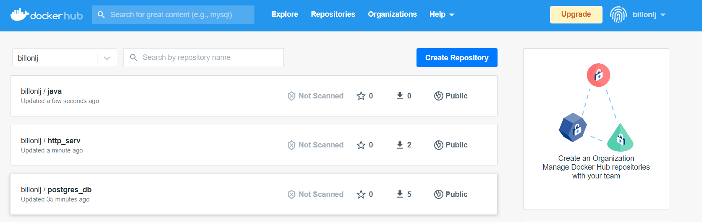

# DevOps
## Compte rendue TP1
### Database
**Why should we run the container with a flag -e to give the environment variables?**  
Cela permet plus de sécurité en évitant par exemple de devoir écrire les mots de passe dans un fichier de configuration  

**Why do we need a volume to be attached to our postgres container ?**
Cela nous permets de faire persiter nos données malgrés l'arrets/supression du docker

Built && run database container
```Docker
docker build -t billonlj\postgres_db .
docker run -d -p 5432:5432 --name postgres_db -v /home/billonlj/CPE-Lyon/DevOps/Database/db-data/:/var/lib/postgresql/data billonlj\postgres_db
```
### Backend API
**1-2 Why do we need a multistage build ? And explain each steps of this dockerfile**  
Cela nous permets de séparer le build de notre projet et l'execution de celui-ci. Car dans notre environement de production il nous faut juste pouvoir executé notre code il nous est pas nécessaire d'avoir un JDK, un jre (Java Runtime Environment) suffit.
```Docker
# Build
FROM maven:3.6.3-jdk-11 AS myapp-build # recupere l'image maven 
ENV MYAPP_HOME /opt/myapp #définit une variable d'environement 
WORKDIR $MYAPP_HOME #définit le répertoire de travail pour toutes les instructions RUN, CMD, ENTRYPOINT, COPY et ADD qui suivent.
COPY pom.xml . #Copie le fichier pom.xml
COPY src ./src #Copie le dossier src
RUN mvn package -DskipTests #lance la commande "mvn package -DskipTests"
# Run
FROM openjdk:11-jre # recupere l'image openjdk version 11-jre 
ENV MYAPP_HOME /opt/myapp #définit une variable d'environement 
WORKDIR $MYAPP_HOME #définit le répertoire de travail pour toutes les instructions RUN, CMD, ENTRYPOINT, COPY et ADD qui suivent.
COPY --from=myapp-build $MYAPP_HOME/target/*.jar $MYAPP_HOME/myapp.jar #Copie le fichier .jar creer dans l'image précédentes 
ENTRYPOINT java -jar myapp.jar #execute le fichier myapp.jar au lancement du docker
```
Build && run Backend container
```Docker
docker build -t billonlj\java .
docker run -d -p 8080:8080 --name java_main billonlj\java
```

Créer un network pour faire communiquer nos conteneur, puis relancé les conteneur avec l'option --net nom_network
```Docker
docker network create DevOps
```
### HTTP Reverse
**Why do we need a reverse proxy ?**  
Cela nous permet d'avoir un seul point d'entrer pour nos différents services, et exposée seulement ceux que l'on souhaite. Mais aussi d'avoir une application plus sécurisée due au fait qu'il n'y a qu'un seul point d'entrée a protégé
Build && run apache container  
```Docker
docker build -t billonlj\http .
docker run -d -p 81:80 --name http_serv --net DevOps billonlj\http
```
**Why is docker-compose so important ?**  
Docker composé va nous permettre de gérer simplement plusieurs containers, plutôt que d’avoir une commande par container, on va pouvoir définir la configuration de nos différentes images dans un fichier puis toutes les lancé en 1 seule commande.   
**1-3 Document docker-compose most important commands**  
Lancer un fichier docker compose
```Docker
docker-compose up -d
```
Lancer un fichier docker compose en forcant le build des images
```Docker
docker-compose up -d --build
```
Arretter et supprimer les container d'un fichier docker-compose : 
```Docker
docker-compose down
```
**1-4 Document your docker-compose file**
```Docker
version: '3.7'
services:
  backend:
    container_name: java_main   
    build: "./Backend API/simple-api/"
    networks:
      - "my-network"
    depends_on:
      - "database"

  database:
    container_name: postgres_db   
    build: "./Database/"
    networks:
      - "my-network"
    volumes:
      - ./Database/db-data/:/var/lib/postgresql/data/
  httpd:
    build: "./HTTP Serveur/"
    ports:
      - "81:80"
    networks:
      - "my-network"
    depends_on:
      - "backend"
networks:
  my-network:
```
### Publish
**1-5 Document your publication commands and published images in dockerhub**  
```Docker
docker tag devops_database billonlj/postgres_db:1.0
docker push billonlj/postgres_db:1.0

docker tag devops_backend billonlj/java:1.0
docker push billonlj/java:1.0

docker tag devops_httpd billonlj/http_serv:1.0
docker push billonlj/http_serv:1.0
``` 
  
**Why do we put our images into an online repository ?**  
Cela nous permet de sauvegarder nos images, ainsi que de les partager. Cela nous permet aussi d'y avoir accès depuis n'importe ou.

## Compte rendue TP2
### Setup Github Actions
**2-1 What are testcontainers?**
il s'agit d'une bibliothèque java permettant d'exécuter nos tests à l'intérieur d'un conteneur.  

**.main.yml file :**
```Yaml
name: CI devops 2022 CPE
on:
  #to begin you want to launch this job in main and develop
  push:
    branches: 
      - main
      - develop

  pull_request:

jobs:
  test-backend:
    runs-on: ubuntu-18.04
    steps:
      #checkout your github code using actions/checkout@v2.3.3
      - uses: actions/checkout@v2.3.3

      #do the same with another action (actions/setup-java@v2) that enable to setup jdk 11
      - name: Set up JDK 11
        uses: actions/setup-java@v2
        with:
          distribution: 'adopt'
          java-version: '11'
          cache: 'maven'

      #finally build your app with the latest command
      - name: Build and test with Maven
        env:
          GITHUB_TOKEN: ${{ secrets.GITHUB_TOKEN }}  # Needed to get PR information, if any
          SONAR_TOKEN: ${{ secrets.SONAR_TOKEN }}
        run: mvn -B verify sonar:sonar -Dsonar.projectKey=billonlj_DevOps -Dsonar.organization=billonlj -Dsonar.host.url=https://sonarcloud.io --file "./Backend API/simple-api/pom.xml"

  # define job to build and publish docker image
  build-and-push-docker-image:
    needs: test-backend
    # run only when code is compiling and tests are passing
    runs-on: ubuntu-latest
    # steps to perform in job
    steps:
      - name: Checkout code
        uses: actions/checkout@v2

      - name: Login to DockerHub
        run: docker login -u ${{ secrets.DOCKERHUB_USERNAME }} -p ${{secrets.DOCKERHUB_TOKEN }}

      - name: Build image and push backend
        uses: docker/build-push-action@v2
        with:
          # relative path to the place where source code with Dockerfile is located
          context: "./Backend API/simple-api/"
          # Note: tags has to be all lower-case
          tags: ${{secrets.DOCKERHUB_USERNAME}}/tp-devops-cpe:simple-api
          push: ${{ github.ref == 'refs/heads/main' }}
      - name: Build image and push database
        uses: docker/build-push-action@v2
        with:
          # relative path to the place where source code with Dockerfile is located
          context: "./Database/"
          # Note: tags has to be all lower-case
          tags: ${{secrets.DOCKERHUB_USERNAME}}/tp-devops-cpe:database
          push: ${{ github.ref == 'refs/heads/main' }}
      - name: Build image and push httpd
        uses: docker/build-push-action@v2
        with:
          # relative path to the place where source code with Dockerfile is located
          context: "./HTTP Serveur/"
          # Note: tags has to be all lower-case
          tags: ${{secrets.DOCKERHUB_USERNAME}}/tp-devops-cpe:http-serv
          push: ${{ github.ref == 'refs/heads/main' }}
```
## Compte rendue TP3
### Intro
**3-1 Document your inventory and base commands**
```Yaml
all:
  vars:
    ansible_user: centos
    ansible_ssh_private_key_file: ~/.ssh/id_rsa_takima
  children:
    prod:
      hosts: jeremi.billon-lanfrey.takima.cloud
```
Tester l'inventorie 
```
ansible all -i inventories/setup.yml -m ping
```
recuperer OS distribution 
```
ansible all -i inventories/setup.yml -m ping
```
Désinstaller apache
```
 ansible all -i inventories/setup.yml -m yum -a "name=httpd state=absent" --become
```
**3-2 Document your playbook**
```Yaml
- hosts: all
  gather_facts: false
  become: yes
  roles:
    - install docker
```
## Deploy your app
**3-3 Document your docker_container tasks configuration**  
Role create network: 
```Yaml
- name: Create a network
  docker_network:
    name: my-network
```
Role launch app: 
```Yaml
- name: Create app container
  docker_container:
    name: java_main
    image: billonlj/tp-devops-cpe:simple-api
    networks:
      - name: "my-network"
```
Role launch database: 
```Yaml
- name: Create database container
  docker_container:
    name: postgres_db
    image: billonlj/tp-devops-cpe:database
    volumes:
      - /home/billonlj/CPE-Lyon/DevOps/Database/db-data
    networks:
      - name: "my-network"
```
Role launch proxy: 
```Yaml
- name: Create proxy container
  docker_container:
    name: proxy
    image: billonlj/tp-devops-cpe:http-serv
    ports:
     - "80:80"
    networks:
      - name: "my-network"
```

## Commande
build une image depuis un Dockerfile : 
```Docker
docker build -t <name_image> 
```

Lancer un conteneur : 
```Docker
docker run <conteneur_name>
```

récuperer une image : 
```Docker
docker pull <image_name>
```

Voir les images disponibles sur la machine
```Docker
docker images
```

Voir les conteneurs actif sur la machine
```Docker
docker ps
```

Voir les conteneurs qui ont été exécuter sur la machine
```Docker
docker ps -a
```
Tester la configuration ansible
```
  ansible all -m ping --private-key=<path_to_your_ssh_key> -u centos
```
Installer Apache sur un serveur
```
ansible all -m yum -a "name=httpd state=present"
--private-key=<path_to_your_ssh_key> -u centos --become
```
**--become** flag tells Ansible to perform the command as a super user
